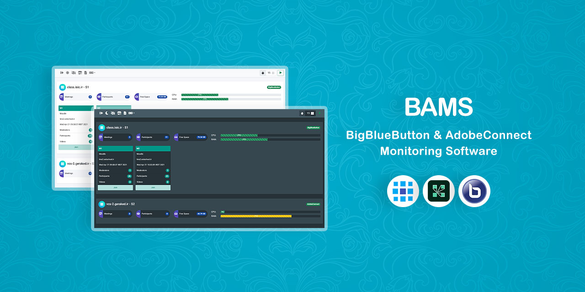

# BAMS


BigBlueButton & AdobeConnect Monitoring Software

It shows in progress meetings of both BigBlueButton and AdobeConnect with current usage of server resources in an integrated view. 

## Installation

It can be installed on web hosting control panels or servers that support PHP v7.0 or above.

Upload the contents of `src` folder to your host and open `config.php` file with a text editor.

Set the correct `URL` of the program started with `http(s)://` and followed by a trailing slash.
For example:
```php
define('URL', 'http://localhost/bams/');
```

Determine the `SERVERS` parameter. Suppose we have one BigBlueButton server and one AdobeConnect server, the parameter would look like this:
```php
const SERVERS = [
    [
        'id'        => '1',
        'type'      => BIGBLUEBUTTON,
        'domain'    => 'vc1.example.com',
        'secret'    => 'xxxxxxxxxx',
        'title'     => 'Server 1',
    ],
    [
        'id'        => '2',
        'type'      => ADOBE_CONNECT,
        'domain'    => 'vc2.example.com',
        'login'     => 'xxxxxxxxxx',
        'password'  => 'xxxxxxxxxx',
        'title'     => 'Server 2',
    ],
];
```

Determine the `USERS` parameter. In the following example, we have `usr1` which can access all of the servers and `usr2` that can only access the server with the id `2`. (If the `acl` property would be empty or not set, the user can access all the servers.)
```php
const USERS = [
    [
        'username'  => 'usr1',
        'password'  => 'usr1',
        'name'      => 'User 1',
    ],
    [
        'username'  => 'usr2',
        'password'  => 'usr2',
        'name'      => 'User 2',
        'acl'       => ['2',],
    ],
];
```

### Servers Configuration

These steps are optional. If you'd like to see the usage of server resources in the Dashboard, follow them.

#### BigBlueButton Server

Upload `bams.php` file located in `tools` folder to the server, in the following directory:
```
/var/www/bigbluebutton-default/
```

Run this command to open the editor:
```
sudo nano /etc/nginx/sites-available/bigbluebutton
```

Copy the following code after `location` block, then save and exit the editor.
```nginx
location ~ \.php$ {
    include /etc/nginx/fastcgi_params;
    fastcgi_pass unix:/run/php/php-fpm.sock;
    fastcgi_param SCRIPT_FILENAME /var/www/bigbluebutton-default/$fastcgi_script_name;
}
```

Make sure PHP package is installed on the server.

Finally execute this command:
```
sudo apt install sysstat
```

#### AdobeConnect Server

Upload `bams.war` file located in `tools` folder to the server, in the following directory:
```
C:\Connect\10.8.0\appserv\webapps\
```
According to the installed version of AdobeConnect and the path, it may be a little different.

## Author

**Rabist** - view on [LinkedIn](https://www.linkedin.com/in/rabist)

## License

Licensed under [MIT](LICENSE).
